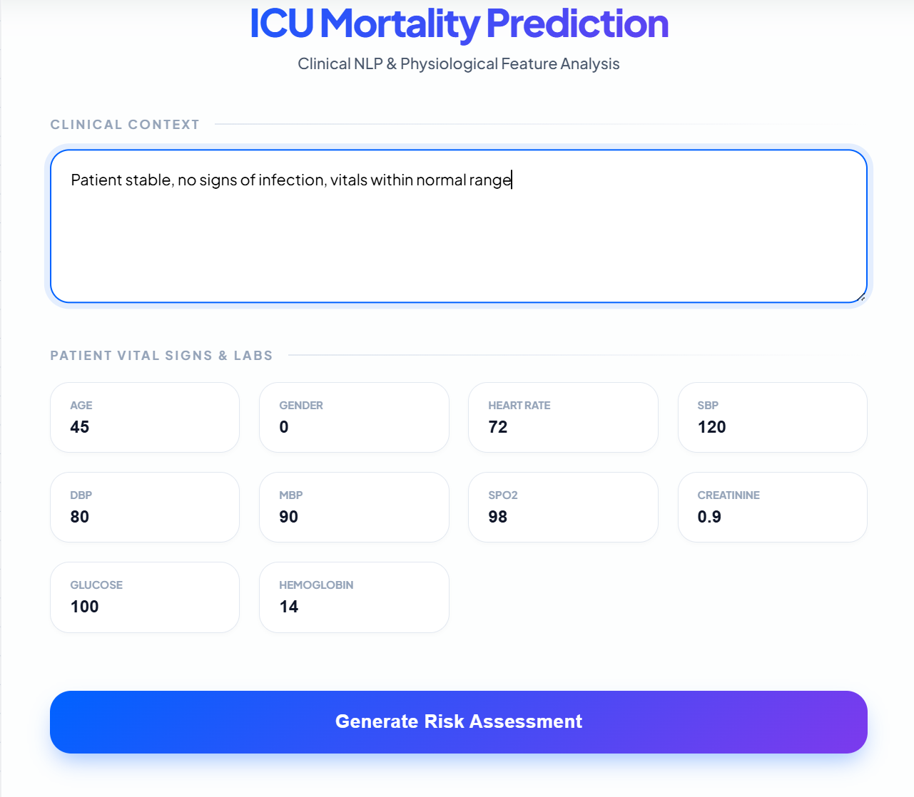
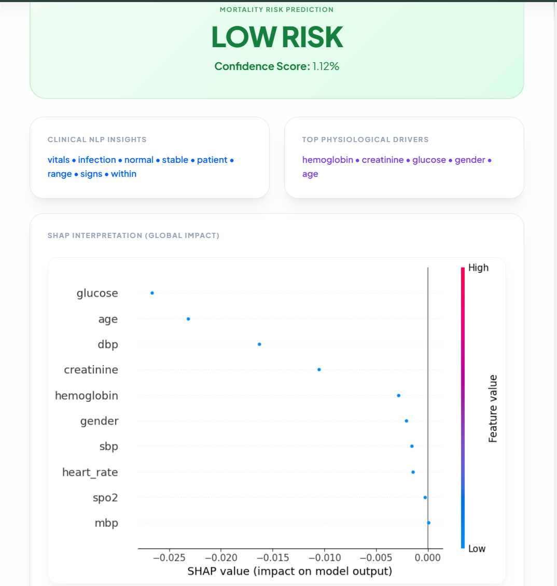
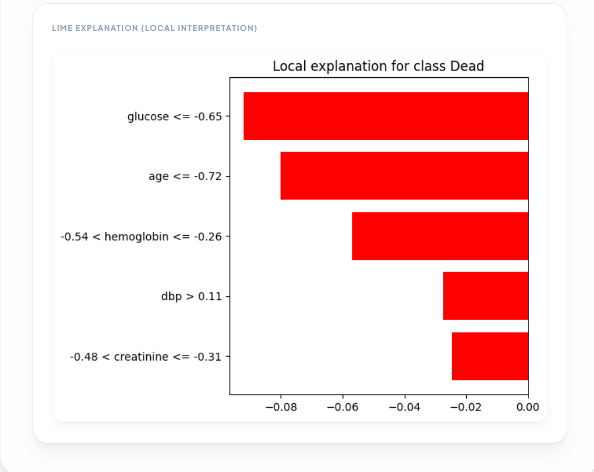

# 🧠 Multimodal Explainable Clinical NLP System for ICU Mortality Prediction

🚀 A full-stack AI system that predicts ICU patient mortality risk using clinical text + physiological data, enhanced with multi-level explainable AI.

---

## 📌 Overview

This project presents a **multimodal deep learning system** that integrates:

- 📝 Clinical Notes (BioBERT)
- 📊 Structured ICU Data (Vitals & Labs)

to predict:

> ⚠️ **Patient Mortality Risk (HIGH / LOW)**

Additionally, the system provides **transparent explanations** using:

- 🧠 Attention (text understanding)
- 📊 SHAP (global feature importance)
- 🔬 LIME (local explanation)

---

## 🏆 Key Features

✅ Hybrid Model (Text + Structured Data)  
✅ Real-time Prediction API (FastAPI)  
✅ Interactive Web UI  
✅ Explainable AI (XAI):
- Attention-based text insights  
- SHAP global importance  
- LIME local explanation  

✅ Clinical Reasoning Output  
✅ Auto Model Download (Google Drive)

---

## 🧠 Model Architecture

Clinical Notes → BioBERT → Embeddings
Vitals/Labs → Neural Network
↓
Fusion Layer
↓
Mortality Prediction

---

## 📊 Explainability Framework (Novel Contribution 🔥)

We propose a **Multi-Level Explainability Framework**:

| Level | Method | Purpose |
|------|-------|--------|
| 🧠 Text | Attention | Important medical terms |
| 📊 Global | SHAP | Feature importance |
| 🔬 Local | LIME | Individual prediction explanation |

---

## 🖥️ Web Application

### 🔹 Input
- Clinical Notes
- Patient Vitals & Lab Values

### 🔹 Output
- Mortality Risk (HIGH / LOW)
- Confidence Score
- Important Clinical Terms
- Feature Importance
- SHAP Graph
- LIME Graph

---

## 📸 Demo Screenshots

### 📝 Input Interface

---

### 📊 Prediction Output

**Mortality Risk Prediction**
ex.
LOW RISK
Confidence Score: 1.12%

---

### 🧠 Clinical NLP Insights
ex.
vitals • infection • normal • stable • patient • range • signs • within

---

### 📊 Top Physiological Drivers
ex.
hemoglobin • creatinine • glucose • gender • age

---

### 📈 SHAP Global Feature Importance

---

### 🔬 LIME Local Explanation

---

## 🧪 Sample Input

'json'
{
  "text": "Patient is stable, vitals within normal range, no signs of infection",
  "features": [45, 1, 78, 120, 80, 95, 98, 1.0, 100, 14]
}

⚙️ Installation & Setup
1️⃣ Clone Repository
git clone https://github.com/YOUR_USERNAME/mimic-nlp-explainable-ai.git
cd mimic-nlp-explainable-ai

⚙️ Installation & Setup
1️⃣ Clone Repository
git clone https://github.com/YOUR_USERNAME/mimic-nlp-explainable-ai.git
cd mimic-nlp-explainable-ai
2️⃣ Install Dependencies
pip install -r backend/requirements.txt
3️⃣ Run Backend
cd backend
uvicorn main:app --reload
4️⃣ Run Frontend

Open:

frontend/index.html
📦 Model Setup

The trained model is not included due to size limitations.

👉 It will be automatically downloaded on first run.

OR manually download:

🔗 [https://drive.google.com/file/d/1g9yuOIIFgxG-xR4_ri6w6LRpv9OBsvQw/view?usp=sharing]

Place it in:

backend/models/hybrid_model.pth
🔐 Security & Compliance
Uses de-identified MIMIC dataset
No personal patient data stored
Designed with HIPAA-compliant principles
📊 Evaluation Metrics
Metric	Score
Accuracy	~0.80
F1 Score	~0.47
AUC	~0.87
🧾 Research Contribution

“We propose a unified multi-level explainability framework combining attention, SHAP, and LIME for multimodal clinical prediction to enhance transparency and clinical trust.”

🛠️ Tech Stack
Backend
FastAPI
PyTorch
Transformers (BioBERT)
Frontend
HTML / CSS / JavaScript
Explainability
SHAP
LIME
Attention Mechanism
📌 Future Work
Temporal modeling (time-series ICU data)
Dashboard visualization
Role-based clinical access
Cloud deployment
👨‍💻 Author

Your Name
